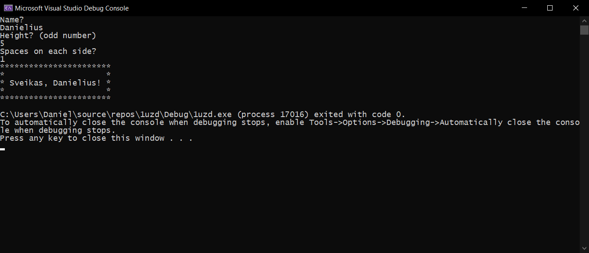

# Objektinio programavimo 1 užduotis
Programa nuskaito vartotojo vardą, eilučių bei tarpų skaičių ir atspausdina įrėmintą "kortelę"

## Įdiegimas (Unix kompiuteryje) naudojant `gcc`kompiliatorių 

- `git clone https://github.com/danielius-g-isi/1uzd.git`
- `cd 1uzd`
- `gcc -std=c++11 main.cpp -o main`
- `./main`

## Versijų istorija (changelog)

---

## [v0.1](https://github.com/danielius-g-isi/1uzd/tree/v0.1) (14-02-2020)
* Pirma ir paskutinė (penkta) eilutės - "rėmelis", kuris susideda iš '\*' simbolių sekos.
* Antra ir ketvirta eilutės - prasideda ir baigiasi '\*' simboliu, vidus užpildytas tarpais.
* Trečia eilutė - '\*', tarpas, "Sveikas, ", vartotojo įvertas vardas, '!', tarpas, '\*'.
* Kortelės ilgis priklauso nuo vartotojo įvesto vardo, pasisveikinimo, ir simbolių pradžioje ir pabaigoje.

## [v0.2](https://github.com/danielius-g-isi/1uzd/tree/v0.2) (14-02-2020)
Versija 0.1 praplėsta:
Jeigu vartotojo vardas baigiasi 's' raide, pasisveikinimas bus "Sveikas, ", kitu atvėju "Sveika, ".

## [v1.0](https://github.com/danielius-g-isi/1uzd/tree/v1.0) (14-02-2020)
Modifikuota versiją (v0.2).
* Visos eilutės saugomos struktūroje
* Nadotojas nurodo rėmelio plotį (eilučių skaičių) ir tarpų skaičių. Pasisveikinimas išlieka kortelės viduryje.

## Opublikuotos versijos:
- [v0.1](https://github.com/danielius-g-isi/1uzd/releases/tag/v0.1)
- [v0.2](https://github.com/danielius-g-isi/1uzd/releases/tag/v0.2)
- [v1.0](https://github.com/danielius-g-isi/1uzd/releases/tag/v1.0)
